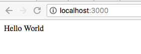

# express-hello-world

Embedded below is essentially the simplest Express app you can create. 
It is a single file app — not what you’d get if you use the Express generator, 
which creates the scaffolding for a full app with numerous JavaScript files, 
Jade templates, and sub-directories for various purposes.

This app starts a server and listens on port 3000 for connections. The app 
responds with “Hello World!” for requests to the root URL (/) or route. 
For every other path, it will respond with a 404 Not Found.

The example above is actually a working server: Go ahead and click on the 
URL shown. You’ll get a response, with real-time logs on the page, and 
any changes you make will be reflected in real time. This is powered 
by RunKit, which provides an interactive JavaScript playground connected 
to a complete Node environment that runs in your web browser. Below are 
instructions for running the same app on your local machine.


## Web Applications

Express is a minimal and flexible Node.js web application framework 
that provides a robust set of features for web and mobile applications.

## APIs

With a myriad of HTTP utility methods and middleware at your disposal, 
creating a robust API is quick and easy.

## Performance

Express provides a thin layer of fundamental web application features, 
without obscuring Node.js features that you know and love.

## Frameworks

Many popular frameworks are based on Express.

## Running Locally
First create a directory named myapp, change to it and run npm init. Then install express as a dependency, as per the installation guide.

In the myapp directory, create a file named app.js and copy in the code from the example above.

The req (request) and res (response) are the exact same objects that Node provides, so you can invoke req.pipe(), req.on('data', callback), and anything else you would do without Express involved.

Run the app with the following command:

```bash
$ node app.js
```

```bash
$ make run
node app.js
{ address: '127.0.0.1', family: 'IPv4', port: 3000 }
Example app listening at http://127.0.0.1:3000
```

Then, load [http://localhost:3000/](http://localhost:3000/) in a browser to see the output.




